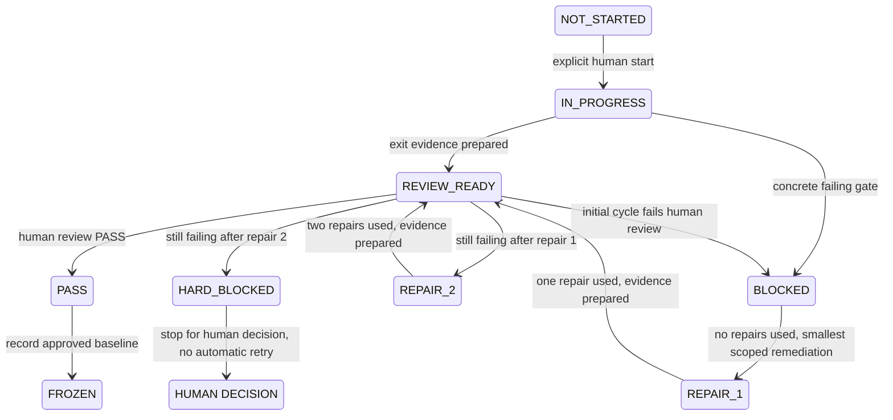

# PROJECT TIMELINE — MVP v0.1

## Authority and current checkpoint

This is the **single authoritative execution timeline**. Product intent remains docs/MASTER_PRODUCT_SPEC.md; original M0.1–M0.32 are preserved below. The human governance request in docs/P0_GOVERNANCE_FREEZE_REQUEST.md controls the frozen P0 baseline; docs/P0_2_AUTONOMOUS_AUTHORIZATION.md now governs bounded P1–P6 DEV execution, superseding routine approval waits while preserving constrained capabilities, independent review and all V4 trust/security checks. MASTER_EXEC_PLAN.md is only the current-state ledger; ROADMAP.md is an index; REQUIREMENTS.md is the D01–D31 evidence cross-map.

Current Part: P1. POST_FAILURE_DIAGNOSTIC_ANALYSIS of the SHA256-verified operator handoff 5d6a17eb8a205bbff38d01adc2aab53d09b3f7daec09ea6bc9afed083a25e128 proves the controller raised RuntimeError: Runtime readiness deadline exceeded at start_runtime line340 after30 aggregate health attempts. Builder exit0, launched container image IDs and preserved failed-source snapshot match accepted inputs by operator evidence; the inner health exceptions are discarded, so the failing endpoint/component and root cause remain NOT_ESTABLISHED. The16-case differential is recorded. P1 BLOCKED / HARD_BLOCKED; full independent review PENDING; repair_cycle2; INITIAL failed/consumed; REPAIR_1 failed/consumed1/1; REPAIR_2 failed/consumed1/1; automatic retries0; repair budget exhausted. Analysis performed no runtime/privileged/source/configuration action or counter change. P2–P7 NOT_STARTED; production/main untouched. Next action: One human/operator read-only extraction of retained DEV-only homepage access/error log records for 2026-10-06T13:31:34Z through 13:32:36Z, with coverage/retention and caller-attribution limits. No runtime reproduction, new request, repair, retry or deployment; exhausted budget remains unchanged. Evidence: .ops/reports/P1/REPAIR_2_POSTFAILURE_DIAGNOSTIC_REPORT.md and .ops/reports/P1/REPAIR_2_POSTFAILURE_DIAGNOSTIC_ANALYSIS.json.

There are exactly eight Parts, P0–P7. No additional top-level Part may be created without explicit human approval. Existing implementation is reconciled and validated within these Parts; NOT_STARTED refers to the newly governed execution/acceptance cycle, not absence of previously written code.

## Evidence and milestone status meanings

IMPLEMENTATION is COMPLETE, PARTIAL or NOT_STARTED. COMPLETE means the named milestone's source/documentation foundation is present and supported by existing inspection/evidence; it does not mean deployed product completion. PARTIAL marks incomplete integration or insufficient proof of the full implementation surface. LOCAL_TEST is PASS, PARTIAL or NOT_RUN and describes the cited bounded local checks only, not exhaustive coverage. DEV_ACCEPTANCE is PASS, PENDING or NOT_APPLICABLE. No local fixture/mock/static approval can become DEV PASS.

The retained V4 bundle/log records 46 Python tests, 26 TypeScript tests and 4 gateway socket tests, plus PHP, shell, formatting/lint/typecheck/build/trusted compilation and fresh offline source checks. They were performed before P0 and are not rerun or relabeled as live evidence. All applicable milestone DEV_ACCEPTANCE below and all D01–D31 statuses remain PENDING. P0 documentation milestones have DEV_ACCEPTANCE NOT_APPLICABLE.

A completion state uses the requested coarse labels NOT_STARTED / IN_PROGRESS / BLOCKED / PASS / FROZEN. Workflow state separately records REVIEW_READY, repair stages and HARD_BLOCKED. REVIEW_READY maps to coarse IN_PROGRESS; REPAIR_1/REPAIR_2 map to IN_PROGRESS; HARD_BLOCKED maps to BLOCKED. Only explicit human review grants completion PASS, immediately recorded as FROZEN with the approved commit/evidence. Local exit checks passing cannot grant human Part PASS.

## Original milestone registry

Every original milestone has exactly one primary Part. Original intent is copied from specification §48. P7 consumes M0.30's validated analytics foundation; it does not reassign or redefine that milestone.

| Milestone | Original intent                            | Primary Part | IMPLEMENTATION | LOCAL_TEST | DEV_ACCEPTANCE | Existing evidence and limits                                                                               |
| --------- | ------------------------------------------ | ------------ | -------------- | ---------- | -------------- | ---------------------------------------------------------------------------------------------------------- |
| M0.1      | Inspect and reconcile existing repository. | P0           | COMPLETE       | PASS       | NOT_APPLICABLE | Preserved repository/history reconciliation; V4 source/handoff ancestors.                                  |
| M0.2      | Persist master specification.              | P0           | COMPLETE       | PASS       | NOT_APPLICABLE | docs/MASTER_PRODUCT_SPEC.md persisted unchanged.                                                           |
| M0.3      | AGENTS + architecture/security docs.       | P0           | COMPLETE       | PASS       | NOT_APPLICABLE | AGENTS.md, ARCHITECTURE.md, SECURITY.md; static V4 boundary review.                                        |
| M0.4      | MASTER_EXEC_PLAN.                          | P0           | COMPLETE       | PASS       | NOT_APPLICABLE | Current MASTER_EXEC_PLAN.md; P0 content/consistency checks.                                                |
| M0.5      | Safe DEV deployment kit.                   | P1           | COMPLETE       | PASS       | PENDING        | ops/dev kit and V4 static PASS; 46 Python boundary tests plus 4 gateway tests, no installed proof.         |
| M0.6      | Node/TypeScript workspace.                 | P1           | COMPLETE       | PASS       | PENDING        | Pinned Node 24.21.0/lockfile; V4 fresh offline install and build gates.                                    |
| M0.7      | Fastify /health.                           | P1           | COMPLETE       | PASS       | PENDING        | Fastify structured health; tests/api.test.ts and prior loopback 200.                                       |
| M0.8      | SQLite migrations.                         | P2           | COMPLETE       | PASS       | PENDING        | SQLite WAL/migrations/reopen tests in foundation/api suites.                                               |
| M0.9      | Audit/job lifecycle.                       | P2           | COMPLETE       | PASS       | PENDING        | Persisted lifecycle/admission/priority/concurrency/resource-wait fixtures; foundation/api/advanced suites. |
| M0.10     | SSRF validation.                           | P2           | COMPLETE       | PASS       | PENDING        | URL/DNS/redirect/IP/socket tests; security/foundation suites; trusted V4 policy.                           |
| M0.11     | Website/sitemap discovery.                 | P2           | COMPLETE       | PASS       | PENDING        | Bounded same-origin website/sitemap/index fixtures; foundation/advanced suites.                            |
| M0.12     | Page classification.                       | P2           | COMPLETE       | PASS       | PENDING        | Page kinds/product representatives; discovery fixtures in foundation suite.                                |
| M0.13     | Playwright scanner.                        | P2           | PARTIAL        | PARTIAL    | PENDING        | Scanner adapter and mocked lifecycle tests; real Chromium/sandbox pending.                                 |
| M0.14     | Network metric normalization.              | P2           | COMPLETE       | PASS       | PENDING        | Observed-only normalization and stored metrics; foundation/API fixtures.                                   |
| M0.15     | Lighthouse.                                | P2           | PARTIAL        | PARTIAL    | PENDING        | Lighthouse adapter compiles; no real Lighthouse measurement evidence.                                      |
| M0.16     | Rule Engine V1.                            | P2           | COMPLETE       | PASS       | PENDING        | All 16 deterministic rule families and evidence fixtures; advanced suite.                                  |
| M0.17     | SSE progress.                              | P2           | COMPLETE       | PASS       | PENDING        | Persisted events/SSE output; API and UI fixtures.                                                          |
| M0.18     | Free-report API.                           | P2           | COMPLETE       | PASS       | PENDING        | Free-report API/store/report-engine lifecycle; API fixtures.                                               |
| M0.19     | WordPress plugin foundation.               | P3           | COMPLETE       | PASS       | PENDING        | Plugin nonce/session/capability/commerce source; PHP lint/stub harness.                                    |
| M0.20     | Live scan UI.                              | P3           | COMPLETE       | PASS       | PENDING        | Live-progress UI under jsdom; tests/ui.test.ts.                                                            |
| M0.21     | Free report UI.                            | P3           | COMPLETE       | PASS       | PENDING        | Free-report rendering/escaping under jsdom; tests/ui.test.ts.                                              |
| M0.22     | Site-size calculation.                     | P3           | COMPLETE       | PASS       | PENDING        | Bounded inventory/count/truncation/custom-review fixtures; foundation/advanced suites.                     |
| M0.23     | Trusted pricing/package selection.         | P3           | COMPLETE       | PASS       | PENDING        | Trusted pricing tiers/package-selection event and tamper boundaries; foundation/API/PHP harness.           |
| M0.24     | WooCommerce integration.                   | P3           | PARTIAL        | PASS       | PENDING        | WooCommerce hook/cart/payment integration source and PHP stubs; configuration not installed.               |
| M0.25     | Paid audit lifecycle.                      | P4           | COMPLETE       | PASS       | PENDING        | Paid-order uniqueness/idempotent jobs; API/advanced fixtures.                                              |
| M0.26     | Secure report access.                      | P4           | COMPLETE       | PASS       | PENDING        | Opaque token/order/contact authorization and UI fragment removal; API/foundation/UI fixtures.              |
| M0.27     | Interactive Fix Center.                    | P4           | COMPLETE       | PASS       | PENDING        | Evidence/fix steps/claim states; report/rule/API/UI fixtures.                                              |
| M0.28     | Retest/before-after foundation.            | P4           | COMPLETE       | PASS       | PENDING        | Previously audited-page retest reuse and before/after comparison; advanced fixtures.                       |
| M0.29     | Expert flow.                               | P4           | PARTIAL        | PASS       | PENDING        | Expert request/admin-state/evidence reuse source and API fixtures; actual customer/admin flow pending.     |
| M0.30     | First-100 analytics.                       | P4           | PARTIAL        | PARTIAL    | PENDING        | Analytics persistence/events and resource sampling source; local records, no cohort/live measurements.     |
| M0.31     | Security/E2E/resource validation.          | P5           | PARTIAL        | PARTIAL    | PENDING        | V4 local tests (76 total) evidence/static PASS; real security/E2E/cgroup acceptance not run.               |
| M0.32     | DEV release candidate.                     | P6           | NOT_STARTED    | NOT_RUN    | PENDING        | No reviewed deployed release candidate yet.                                                                |

## Fixed execution rules

1. Work only one Part at a time.
2. P0.1 grants one bounded P1–P6 execution authorization. Advance sequentially only after full technical exit evidence is persisted, no human/operator action or concrete blocker remains, and V4 boundaries are unchanged. Record EXECUTION_PASS with INDEPENDENT_REVIEW PENDING; Codex never grants human PASS/FROZEN. Stop at WAITING_FOR_HUMAN, SECURITY_REVIEW_REQUIRED, HARD_BLOCKED or P6_REVIEW_READY. P7 needs separate human authorization.
3. Only recorded independent human review grants PASS/FROZEN; persist that decision and exact source/handoff/evidence identity. EXECUTION_PASS alone leaves independent review PENDING.
4. Frozen Parts cannot be redesigned unless a later concrete defect proves a narrowly scoped repair necessary. Record the defect and affected baseline, preserve accepted boundaries, and obtain review of the repair; no reset/rewrite of valid history.
5. Every Part has at most an initial implementation/validation cycle, repair cycle 1 and repair cycle 2.
6. After two failed repair cycles, stop and report the concrete blocker. No endless redesign or retry loop.
7. No speculative refactor.
8. No new infrastructure without an explicit requirement and human scope decision.
9. Evidence is stronger than claims; separate implementation, local tests and real acceptance.
10. A blocker contains the exact failing requirement, exact command/test, exact error/evidence and smallest proposed remediation.
11. Do not bundle unrelated improvements into a Part.
12. Never touch production; this includes P7. Production remains out of scope after first 100 unless the human explicitly changes scope/authorization.
13. Commit/push only develop. Never modify main or discard valid accepted history.
14. Preserve all accepted V4 security boundaries: immutable reviewed proxy/gateway/image; frozen manifests/dependencies; offline mutable builds; dedicated verified networks/membership; separated secrets; verified host deny; deterministic archive identity; reviewed root snapshot/clean isolated interpreters; human-only PHP/config.php mode 0600; health-only public nginx; SSRF/sandbox/resource/log/retention/rollback/concurrency controls.
15. Human approval is required before root execution, privileged Docker installation, systemd installation, Plesk/nginx changes, WordPress plugin installation or WooCommerce manual configuration changing DEV. These are designated human/operator actions. Codex never gains root/escalation, Docker socket/group, Plesk-admin or direct production access from such approval.
16. P1–P6 use the bounded P0.1 umbrella authorization in rule 2. P7 remains separately human-authorized. A pending operator or security gate forbids next-Part advancement.
17. Timebox work to the current exit gate. Planning estimates below exclude external human wait time and are not measurements or promises. Bound each initial cycle to its estimated upper active-time limit; each repair cycle has at most that same upper limit. If the budget/exit gate cannot be met, report the exact blocker and seek a human decision; do not silently expand scope/time.
18. No “while I am here” feature additions.

Record cycle number, failing criterion/evidence and human decision in MASTER_EXEC_PLAN.md/.ops/ACTION_REQUIRED.md. A human/operator wait is WAITING_FOR_HUMAN under P0.1, not a technical failure; repair cycles are not consumed by waiting. Available independent work is limited to the current Part and current authorization. Static V4 PASS is a prerequisite, not P1 PASS or installation authorization.

## Independent acceptance state machine — frozen P0 model

The diagram below describes independent acceptance and the original P0 workflow. P1–P6 execution now uses the separate P0.1 states below; this diagram never authorizes Codex to award human PASS/FROZEN.



Use the cycle ledger to disambiguate REVIEW_READY's outgoing failure path: initial failure → BLOCKED/REPAIR_1; repair 1 failure → REPAIR_2; repair 2 failure → HARD_BLOCKED/HUMAN_DECISION. HUMAN_DECISION is a terminal agent wait, not permission to reset counters or create a third repair cycle. A frozen-Part defect requires an explicit, evidenced repair decision; it does not reopen adjacent Parts. Independent review remains mandatory for human PASS/FROZEN. P0.1 allows sequential technical execution of P1–P6 before that review only under rule 2; operator/security gates still require a stop.

## P0.2 current execution amendment

The human Master Authorization V2 is persisted verbatim in docs/P0_2_AUTONOMOUS_AUTHORIZATION.md. It supersedes routine micro-approval waits within approved DEV capabilities; it does not reopen P0 or weaken V4. Only LAUNCH_CRITICAL, SECURITY_CRITICAL or RELIABILITY_CRITICAL tasks mapped to the stated business/security/reliability/release goals may run. Advance P1–P6 after required real technical exits; persist/push every meaningful process using append-only .ops/oversight/events/ and LATEST_CHECKPOINT.json/.md. External oversight PENDING is not a stop or independent PASS. Preserve INITIAL + REPAIR_1 + REPAIR_2, one deployment per distinct cycle, zero automatic retries and no counter reset.

P0.2 stop states are SECURITY_REVIEW_REQUIRED, HARD_BLOCKED, HUMAN_CAPABILITY_GATE, BUSINESS_DECISION_REQUIRED, EXTERNAL_CREDENTIAL_REQUIRED, P6_REVIEW_READY and PRODUCTION_GO_LIVE_REQUIRED. Approval never grants raw root, escalation, socket/group access or a general root bridge. P0.2§8 authorizes only the existing candidate-pinned controller refresh with unchanged trust/rollback checks; §9 grants one REPAIR_1 attempt only after verified success. Do not rerun installation/rebuild image/clean evidence. P0.2§19 explicitly permits first-runtime restoration proof to remain PENDING until later controlled validation with a prior runtime; do not fabricate that proof or mark its D criterion PASS. Other P1 runtime/security/resource/health/retention exits remain mandatory. P7/production/main remain forbidden. Earlier P0/P0.1 diagrams and retained approval recipes are historical governance; the current human amendment governs routine execution.

## Orchestrated P1–P6 execution states

Current execution authority: docs/P0_2_AUTONOMOUS_AUTHORIZATION.md; retain the criterion-level evidence schema from docs/P0_1_ORCHESTRATOR_AUTHORIZATION.md. The seven P0.2§34 stop states supersede routine WAITING_FOR_HUMAN. .ops/ORCHESTRATOR_STATUS.json records IN_PROGRESS, SELF_REPAIR_1, SELF_REPAIR_2, EXECUTION_PASS, WAITING_FOR_HUMAN, SECURITY_REVIEW_REQUIRED, HARD_BLOCKED or P6_REVIEW_READY. Only an initial cycle and at most two repairs are allowed. The specific Part-exit instruction uses execution_state EXECUTION_PASS (rather than the introductory shorthand PASS); independent_review remains PENDING. Human evidence resumes the same Part without spending a repair. Any apparent need to change a frozen V4 boundary stops at SECURITY_REVIEW_REQUIRED before implementation.

Each Part persists criterion-level REPORT.md, EVIDENCE.json and CHECKSUMS.sha256 under .ops/reports/<PART>/. Human gates additionally require HUMAN_ACTION_REQUIRED.md with the ten human-specified fields. Reports distinguish IMPLEMENTED, LOCAL_TESTED, REAL_DEV_VERIFIED, HUMAN_ATTESTED and NOT_VERIFIED. Evidence results are PASS, FAIL, PENDING_HUMAN or NOT_APPLICABLE; code presence never proves DEV PASS. No secrets or customer identifiers enter these files. P6 binds all identities/D01–D31 and .ops/FINAL_AUDIT_INDEX.md, sets P6_REVIEW_READY and stops.

## MVP SCOPE FREEZE

Until first 100 validation, explicitly OUT OF SCOPE:

- PostgreSQL migration.
- Redis.
- BullMQ.
- Kubernetes.
- Paid AI/LLM runtime.
- Automated live optimization.
- Continuous monitoring platform.
- Production deployment.
- Multi-region.
- Horizontal scaling.
- Microservices split.
- Unnecessary dashboards.
- Extra customer features outside the authoritative MVP scope.

Any future Codex session must reject/defer these unless the human explicitly changes MVP scope. Preserve specification §49's other future-only exclusions and replaceable adapters without building them. First 100 observations inform a later human decision; they do not automatically authorize infrastructure, features, production or an additional Part.

## P0 — Governance Freeze

- **Purpose:** Establish one execution order and an evidence-driven completion system.
- **Exact scope:** Governance/state Markdown only: timeline,32 milestone statuses,31 acceptance mappings, freeze/rules/state machine/handoff, current-state consistency and safe develop commit/push. Preserve historical review facts and all implementation/privileged files.
- **Included original milestones:** M0.1–M0.4, reconciled from the existing source.
- **Current status:** FROZEN following human review PASS of governance commit 1c6303e0c17b04952ee6e9c8b01d6868e53fe152; static V4 prerequisite PASS; no deployment permission.
- **Already implemented:** Authoritative specification, durable rules/docs and prior execution/evidence records; current governance documents reconcile them rather than replacing product intent.
- **Only locally tested:** Prior documentation/source/archive integrity and V4 unit/integration/static evidence. P0 checks documentation/diff/mappings/unchanged code only.
- **Requires real DEV validation:** None for the P0 documentation gate; every applicable product/deployed criterion remains pending for later Parts.
- **Exact entry criteria:** Explicit human P0 task; accepted source 8217aa4/V4 handoff 5c44cb3 preserved; clean develop tree inspected; scope/specification and all current-state files read.
- **Exact exit criteria:** One timeline with exactly P0–P7 and all required Part fields; all32 original milestones assigned once with the three status columns; all31 D rows cross-mapped with local/remaining real evidence and PENDING status; complete scope freeze; state machine/two-repair cap/human review and stop rules; V4 static PASS recorded; installation HOLD/P1 NOT_STARTED/production untouched consistently recorded; only governance files changed; diff/content checks pass; develop committed/pushed and clean. Then REVIEW_READY, stop; human acceptance alone grants PASS/FROZEN.
- **Evidence required:** Exact P0 documentation commit and changed-file list; counts/coverage/content review; unchanged executable/privileged-file comparison to baseline; clean working tree and remote develop equality. No costly application suite rerun.
- **Explicit non-goals:** P1 start; root/Docker/systemd/Plesk/nginx/WP operations; deployment requests; application/security/runtime changes; architecture redesign; new customer features; production.
- **Estimated execution time:** Initial active work 2–4 hours; each permitted repair at most 4 hours; human review wait excluded.
- **Dependencies:** The human P0 request and preserved V4 baseline/static decision.
- **Allowed human actions:** Review P0 documentation and return an explicit governance PASS or concrete failing criterion. No install decision is requested in P0.
- **Allowed Codex actions:** Read project/attachment/history; edit governance Markdown; run non-privileged documentation/integrity checks; commit/push develop; provide the exact P0 handoff and stop.
- **Completion state:** FROZEN; human review PASS; workflow FROZEN. P1 is now separately authorized by P0.1; this does not reopen P0 or authorize operator actions.

## P1 — Security & DEV Deployment Foundation

- **Purpose:** Prove the approved static foundation in the controlled DEV environment.
- **Exact scope:** Reviewed artifact/root trust transition and frozen image/dependencies/proxy/gateway, separate credentials, dedicated verified networks, approved human installation/configuration, reproducible offline source build, internal/public health, bounded resources/status/rollback. Primary acceptance D24–D27; P5 rechecks effective limits/security under live work.
- **Included original milestones:** M0.5–M0.7.
- **Current status:** POST_FAILURE_DIAGNOSTIC_ANALYSIS of the SHA256-verified operator handoff 5d6a17eb8a205bbff38d01adc2aab53d09b3f7daec09ea6bc9afed083a25e128 proves the controller raised RuntimeError: Runtime readiness deadline exceeded at start_runtime line340 after30 aggregate health attempts. Builder exit0, launched container image IDs and preserved failed-source snapshot match accepted inputs by operator evidence; the inner health exceptions are discarded, so the failing endpoint/component and root cause remain NOT_ESTABLISHED. The16-case differential is recorded. P1 BLOCKED / HARD_BLOCKED; full independent review PENDING; repair_cycle2; INITIAL failed/consumed; REPAIR_1 failed/consumed1/1; REPAIR_2 failed/consumed1/1; automatic retries0; repair budget exhausted. Analysis performed no runtime/privileged/source/configuration action or counter change. P2–P7 NOT_STARTED; production/main untouched. Next action: One human/operator read-only extraction of retained DEV-only homepage access/error log records for 2026-10-06T13:31:34Z through 13:32:36Z, with coverage/retention and caller-attribution limits. No runtime reproduction, new request, repair, retry or deployment; exhausted budget remains unchanged. Evidence: .ops/reports/P1/REPAIR_2_POSTFAILURE_DIAGNOSTIC_REPORT.md and .ops/reports/P1/REPAIR_2_POSTFAILURE_DIAGNOSTIC_ANALYSIS.json.
- **Already implemented:** V4 kit, isolated toolchain, Fastify health and frozen security architecture at the approved source; no rebuild/redesign is authorized merely because live validation is pending.
- **Only locally tested:** V4 boundary/socket tests, offline source gates, deterministic archive/hashes, mock deployment/rollback and loopback health.
- **Requires real DEV validation:** Root-installed ownership/hash/image/dependency identity, network membership/egress boundary, secret placement0600, cgroups/seccomp/non-root/readonly/resource/log controls, actual offline build/deploy/status/health/rollback and stale-request refusal. No installation is inferred from static PASS.
- **Exact entry criteria:** P0 human PASS/FROZEN; P0.2 bounded DEV authority; preserved V4 approved commit/archive/hash; approved constrained capability or designated operator for privileged actions; human-controlled root mechanism/configuration/DEV target authority and approved artifact available; no stale trigger. Review any later concrete security defect before implementation changes.
- **Exact exit criteria:** Human-installed immutable reviewed components and frozen dependency baseline match approved hashes; every V4 network/secret/self-host/artifact/sandbox/resource boundary has direct sanitized runtime proof; offline constrained deploy reaches terminal successful status with archive/snapshot identity; internal/public GET health 200 with development/service/version identity; public business routes 404 and no browser master secret; controlled retention verified; first-runtime restoration proof may remain PENDING under P0.2§19 until a prior runtime exists; D24–D27 evidence recorded without promoting later E2E criteria. Record P1 EXECUTION_PASS / independent review PENDING only when all technical criteria pass; persist report/evidence/checksums and advance to P2 only under P0.2 conditions.
- **Evidence required:** Human attestation/output for privileged actions, reviewed hashes/image ID, sanitized ownership/network/container/cgroup inspections, dependency rejection/offline-build results, timestamped deployment/status/health/rollback observations. Never secrets, cookies or tokens.
- **Explicit non-goals:** Autonomous root/Docker/systemd/Plesk actions; automatic PHP deployment; application feature expansion; scans of unrelated sites; production; P2 before full technical exit and cleared operator/security gates.
- **Estimated execution time:** Initial active work 4–8 hours; each permitted repair at most 8 hours; human installation/review wait excluded.
- **Dependencies:** P0 frozen; V4 static PASS and reviewed artifact; designated human installer/DEV configuration. P2 cannot start with unverified containment.
- **Allowed human actions:** After explicit approval, manually install reviewed kit/image/systemd and configure DEV nginx/environment; inspect runtime boundaries and authorize one controlled deployment/rollback validation. No WP deployment by the watcher.
- **Allowed Codex actions:** Only explicitly authorized ordinary-user artifact/request/status/loopback and DEV-health validation through the installed mechanism; gather readable evidence; scoped repairs/tests within P1 authority; develop commit/push/handoff. Never Docker socket/root/operator commands.
- **Completion state:** BLOCKED / incomplete; workflow HARD_BLOCKED; REPAIR_2 runtime-health FAILED/consumed1/1; repair_cycle2 and two failed repair cycles; full review PENDING; P2 NOT_STARTED; human decision required.

## P2 — Audit Engine Live Validation

- **Purpose:** Establish that source foundations produce real measured audit evidence safely.
- **Exact scope:** SQLite/jobs/SSRF/discovery/classification, Playwright/Lighthouse/network normalization/rules/events/free-report API on an authorized public fixture. Primary D04–D13; engine portions of D01–D03/D06/D14/D28 feed later combined validation.
- **Included original milestones:** M0.8–M0.18, preserving both original engine groups.
- **Current status:** NOT_STARTED. Implementation largely exists; real browser/Lighthouse/engine acceptance pending.
- **Already implemented:** Migrations/jobs/admission/queues, bounded inventory and classification, scanner/Lighthouse adapters, observed-only normalized metrics,16 deterministic rules, persisted progress/report surfaces.
- **Only locally tested:** SQLite reopen/concurrency, mocked scanner success/failure/cleanup, controlled DNS/redirect/discovery/metrics/rules/API/SSE fixtures. Actual Lighthouse is not proved by compilation.
- **Requires real DEV validation:** Authorized browser/Lighthouse traffic through trusted egress, actual measured/stored values and findings, sitemap/product representative discovery, single heavy browser job, honest queue/progress/partial-failure output and cleanup.
- **Exact entry criteria:** P1 EXECUTION_PASS with persisted complete technical evidence and no pending operator/security/blocker gate; P0.1 umbrella authorization; proven containment/runtime/health; approved separate public read-only fixture with sitemap/product/redirect cases; safe resource budget and evidence retention rules.
- **Exact exit criteria:** Controlled free/home/product/representative audits complete; migrations/jobs survive restart and retain one running browser job; all DNS/redirect/subresources/Lighthouse enforcement holds; metrics contain measured values or explicitly unknown fields; stored findings match captured measurements/thresholds; real events/free-report API and crash/timeout cleanup observed; D04–D13 and engine contributions documented. Record P2 EXECUTION_PASS / independent review PENDING only when all technical criteria pass; persist report/evidence/checksums and advance to P3 only under P0.1 conditions.
- **Evidence required:** Exact deployed source/archive/snapshot, fixture authorization, timestamps/job IDs, sanitized measurements/DB rows/events/limits/cleanup observations and focused regression outputs. Never fabricated progress or invented causes.
- **Explicit non-goals:** Customer site optimization, paid AI, scanning arbitrary customers, speculative engine replacement/new infrastructure, WP/commerce configuration, production; P3 before full technical exit and cleared operator/security gates.
- **Estimated execution time:** Initial active work 6–12 hours; each permitted repair at most 12 hours; fixture/human wait excluded.
- **Dependencies:** P1 frozen/proven runtime and authorized fixture. All rule explanations remain deterministic/replaceable.
- **Allowed human actions:** Authorize fixture and controlled scans; provide sanitized runtime/browser inspection and bounded resource observations; approve any necessary scoped frozen-boundary repair separately.
- **Allowed Codex actions:** Ordinary-user app-visible scans/status/metrics and focused local tests/repairs within P2; readable evidence; develop commit/push/handoff. No privileged execution; advance to P3 only under P0.1 conditions.
- **Completion state:** NOT_STARTED; workflow NOT_STARTED.

## P3 — WordPress Customer Flow

- **Purpose:** Validate the free customer journey and trusted DEV commerce entry.
- **Exact scope:** Separately approved WP plugin/customer UI/free report, site-size/truncation/custom-review behavior, trusted package/pricing, DEV WooCommerce cart/session/checkout and engine gateway. Primary D01/D06/D14–D17.
- **Included original milestones:** M0.19–M0.24.
- **Current status:** NOT_STARTED. Implementation largely exists; WordPress/WooCommerce DEV acceptance pending.
- **Already implemented:** Plugin/nonce/session gateway and admin foundation, JS UI/progress/free reports, bounded inventory count, tier/package selection, WooCommerce hooks/metadata/idempotency foundations.
- **Only locally tested:** jsdom rendering/escaping/token handling; server pricing/tamper boundary fixtures; PHP lint and stubbed commerce/session/security contract. No activated WordPress proof.
- **Requires real DEV validation:** Actual approved plugin activation/readability, page/session/nonce isolation, real free flow/progress/report and pricing boundary behavior, BDT/manual DEV WooCommerce checkout and protected master-secret transport.
- **Exact entry criteria:** P2 EXECUTION_PASS with persisted complete technical evidence and no pending operator/security/blocker gate; P0.1 umbrella authorization; approved human-only plugin commit/hash artifact; verified DEV PHP owner and config.php mode 0600; separate approval for plugin installation and DEV WooCommerce manual configuration; test/manual payment plan and fixture authorization.
- **Exact exit criteria:** Customer submits controlled URL and sees real persisted progress/free report; dangerous submission refused; nonce/session ownership and escaping hold; size/tier/scope/mode/custom-review cases obey specification and server price; DEV checkout/order metadata match quote and session; browser has no master secret; D01/D06/D14–D17 live evidence recorded. Record P3 EXECUTION_PASS / independent review PENDING only when all technical criteria pass; persist report/evidence/checksums and advance to P4 only under P0.1 conditions.
- **Evidence required:** Separate plugin approval/hash and human install/config attestation, sanitized browser/session/order observations, real report/count/price records, negative session/tamper checks and focused tests. No live payment secrets.
- **Explicit non-goals:** Autonomous PHP installation or watcher PHP updates, live payment configuration, additional dashboards/customer features, production; P4 before full technical exit and cleared operator/security gates.
- **Estimated execution time:** Initial active work 6–12 hours; each permitted repair at most 12 hours; human plugin/commerce wait excluded.
- **Dependencies:** P2 EXECUTION_PASS and complete retained technical evidence; WP/WooCommerce human configuration and approved artifact; root security kit remains frozen.
- **Allowed human actions:** Explicitly approved DEV plugin installation/activation as verified PHP owner; DEV page/BDT/manual-payment configuration; controlled checkout actions and sanitized evidence.
- **Allowed Codex actions:** Ordinary-user browser/API verification of authorized flow; plugin/UI/business-source scoped repairs and tests within P3; prepare separately reviewed artifacts, commit/push/handoff; no direct WP/Plesk/privileged installation.
- **Completion state:** NOT_STARTED; workflow NOT_STARTED.

## P4 — Paid Service Flow

- **Purpose:** Validate paid/report/expert workflows and analytics without live payment or optimization.
- **Exact scope:** Paid job creation/idempotency, strong report verification, Interactive Fix Center, previously audited-page retest/before-after, expert/admin evidence reuse and first 100 event foundation. Primary D18–D22.
- **Included original milestones:** M0.25–M0.30.
- **Current status:** NOT_STARTED. Implementation largely exists; real paid-service E2E pending.
- **Already implemented:** Unique paid order/job lifecycle, token hashes/order/contact authorization, fix evidence/templates/claim states, bounded retest reuse/comparison, expert tasks/requests/admin states, typed analytics/resource sampling.
- **Only locally tested:** Controlled orders/payments/tokens/claim/retest/expert/admin/analytics API fixtures and jsdom report access; scanner measurements are injected.
- **Requires real DEV validation:** Human-approved manual test payment creates exactly one actual paid audit, secure report delivery/access denial, customer Fix Center/retest and measured before-after, expert reuse/admin controls and authentic labeled DEV events/resource records.
- **Exact entry criteria:** P3 EXECUTION_PASS with persisted complete technical evidence and no pending operator/security/blocker gate; P0.1 umbrella authorization; real free/checkout flow and approved test payment procedure; controlled fixture and authorized test identities; P1/P2 security/measurement baseline unchanged.
- **Exact exit criteria:** Repeated test payment callbacks create one paid audit; correct token/order/contact/session required and rate limits observed; Fix Center evidence/claim distinction holds; retest restricted/idempotent and comparisons measured; expert requests reuse evidence and state verification is enforced; D18–D22 recorded from actual labeled controlled DEV journeys. D22 proves instrumentation with real DEV activity, not a fabricated100-customer cohort. Record P4 EXECUTION_PASS / independent review PENDING only when all technical criteria pass; persist report/evidence/checksums and advance to P5 only under P0.1 conditions.
- **Evidence required:** Sanitized order/job/report identifiers, duplicate-hook results, authorization negatives, measured reports/retest comparisons/expert states, event/DB counts and resource observations. No secret-bearing links or customer contact values in logs.
- **Explicit non-goals:** Paid AI, live payment secrets, automatic website changes, claiming a fixed checkbox verifies remediation, new customer accounts/features, production; P5 before full technical exit and cleared operator/security gates.
- **Estimated execution time:** Initial active work 6–12 hours; each permitted repair at most 12 hours; human test-payment/review wait excluded.
- **Dependencies:** P3 frozen and real engine measurements; approved manual payment and permitted expert test identities.
- **Allowed human actions:** Approved DEV test-payment/order/admin operations; approve risky live-site changes separately if ever requested (none required by this Part); review sanitized report/expert behavior.
- **Allowed Codex actions:** Authorized ordinary-user paid/report/customer test journey, scoped business-flow repairs/tests and evidence; develop commit/push/handoff; no privileged config, real payment or live-site optimization.
- **Completion state:** NOT_STARTED; workflow NOT_STARTED.

## P5 — Final Security / E2E / Resource Acceptance

- **Purpose:** Prove the combined release behavior rather than rely on separate local/static claims.
- **Exact scope:** Specification §43 complete controlled journey, adversarial URL/DNS/redirect/browser/Lighthouse tests, authorization/secret/log/retention/cleanup, resource pressure and real containment/rollback evidence. Primary D02/D03/D23/D28/D29; verify accumulated D01–D29 and release evidence prerequisites.
- **Included original milestones:** M0.31.
- **Current status:** NOT_STARTED; full deployed security/E2E/resource acceptance pending.
- **Already implemented:** Local tests and approved V4 security design; existing feature/resource/retention controls. Deployment observations have not established effective enforcement.
- **Only locally tested:** Previously recorded46 Python/30 Node tests, PHP/quality/snapshot gates; runtime boundaries mocked or static, scanner fixtures injected.
- **Requires real DEV validation:** End-to-end submit→progress→free→package→test order→paid→secure report→expert, retest; hostile subresources/redirect/rebinding where controlled; actual resource ceilings/pressure/waits/process cleanup/network isolation and log/artifact/privacy proof.
- **Exact entry criteria:** P4 EXECUTION_PASS with persisted complete technical evidence and no pending operator/security/blocker gate; P0.1 umbrella authorization; P1–P4 evidence identity and approved adversarial fixture; approved bounded failure/rollback/resource tests and sanitized human runtime inspection available.
- **Exact exit criteria:** D01–D29 each PASS from direct current DEV evidence; all critical automated unit/integration/security/E2E gates pass for exact tested artifact; resource/queue/deadline/sandbox/network/secret controls hold under bounded success/error/crash/pressure cases; raw artifacts/logs/releases bounded; no production action; no unresolved failing criterion. D30/D31 remain final P6 release-ledger gates and are checked as readiness here, not preemptively claimed complete. Record P5 EXECUTION_PASS / independent review PENDING only when all technical criteria pass; persist report/evidence/checksums and advance to P6 only under P0.1 conditions.
- **Evidence required:** Per-D criterion timestamps/commands/output/IDs/measurements/limitations, deployed artifact hashes, sanitized human cgroup/network/process/secret-permission inspection, full controlled E2E and regression results; exact blockers follow the two-repair policy.
- **Explicit non-goals:** Acceptance by mock alone, unrelated stress/load testing, unapproved frozen-Part redesign, speculative features/infrastructure, production; P6 before full technical exit and cleared operator/security gates.
- **Estimated execution time:** Initial active work 8–16 hours; each permitted repair at most 16 hours; human/fixture wait excluded.
- **Dependencies:** P4 EXECUTION_PASS and retained complete prior Part evidence; human runtime inspections and safe test authority.
- **Allowed human actions:** Approve/perform necessary bounded DEV fault/resource/operator observations; confirm no production changes and containment evidence; review the full acceptance matrix.
- **Allowed Codex actions:** Authorized non-privileged E2E/security checks and evidence; smallest concrete scoped repair with focused regressions; develop commit/push/handoff; no host security changes/root/Docker; P6 advancement only after the complete P5 technical gate under P0.1.
- **Completion state:** NOT_STARTED; workflow NOT_STARTED.

## P6 — DEV Release Candidate

- **Purpose:** Bind a reviewed DEV candidate to complete acceptance evidence and final state.
- **Exact scope:** Exact tested source/archive/snapshot/plugin identities, final D01–D31 ledger/reproducibility/rollback/handoff and clean develop push. Primary D30/D31 and final reconfirmation of all earlier criteria.
- **Included original milestones:** M0.32.
- **Current status:** NOT_STARTED; no accepted deployed release candidate exists.
- **Already implemented:** Source/export/hash tools and local release preparation foundation; prior develop commits are not a completed DEV RC.
- **Only locally tested:** Previous source reproducibility/hash/commit/push and mock rollback, not a live RC release decision.
- **Requires real DEV validation:** Match reviewed deployed candidate to P5 evidence; final current health/runtime/plugin/ledger identity, safe reproducibility and retained rollback compatibility.
- **Exact entry criteria:** P5 EXECUTION_PASS with persisted complete technical evidence and no pending operator/security/blocker gate; P0.1 umbrella authorization; all D01–D29 live PASS and no unresolved defect; reviewed source/plugin identities and final candidate evidence available.
- **Exact exit criteria:** All D01–D31 PASS for exact DEV candidate; final accepted state ledger matches deployed/source/plugin identities; develop committed/pushed/clean and main/production untouched; complete RC handoff/rollback evidence; persist P6 report/evidence/checksums and FINAL_AUDIT_INDEX, record execution EXECUTION_PASS / independent review PENDING, set P6_REVIEW_READY and stop. Do not publish production or start P7.
- **Evidence required:** Exact commits/archives/SHA/snapshot and installed plugin identity, final per-D evidence cross-map, remote develop equality/clean tree, health/rollback/reproducibility observations and independent human RC review remains PENDING until actually supplied.
- **Explicit non-goals:** Production release/main merge, new features, scaling, bypassing missing evidence, P7 start.
- **Estimated execution time:** Initial active work 2–4 hours; each permitted repair at most 4 hours; human RC review wait excluded.
- **Dependencies:** P5 EXECUTION_PASS and current complete DEV evidence; no implementation rewrite is planned for packaging.
- **Allowed human actions:** Review/accept exact DEV release candidate; approve any needed controlled DEV artifact step separately; explicitly decide whether to start P7.
- **Allowed Codex actions:** Reconcile documentary/source identities, ordinary-user readable health/reproducibility evidence, develop-only commit/push and handoff; no production publish or privileged/operator action.
- **Completion state:** NOT_STARTED; workflow NOT_STARTED.

## P7 — First 100 Customer Validation

- **Purpose:** Observe the frozen MVP with real consenting DEV participants before a later scope decision.
- **Exact scope:** Privacy-conscious first 100 cohort and existing event/resource/report/retest/expert observations; measured outcomes/limitations and evidence-driven backlog recommendations, using the accepted DEV RC. No new top-level milestone or customer feature.
- **Included original milestones:** No newly owned M0 milestone; consumes M0.30 analytics validated in P4 and M0.32 RC from P6 without redefining their intent.
- **Current status:** NOT_STARTED; no100-customer evidence is claimed.
- **Already implemented:** Event storage and workflow/resource sampling foundations. No validated customer cohort is present.
- **Only locally tested:** Analytics fixture records; these are not real customers/conversions or measured cohort statistics.
- **Requires real DEV validation:** Human-defined 100 eligible/consenting participants, target authorization, genuine event counts/denominators/success/failure/usage and measured resource patterns, with test activity labeled separately and unknown data disclosed.
- **Exact entry criteria:** P6 human PASS/FROZEN plus explicit P7 start; human defines eligibility/customer denominator/consent/retention and authorizes every target; accepted DEV RC and safe concurrency/resource caps; manual/test commerce only, no production deployment or customer-site changes.
- **Exact exit criteria:** Evidence for 100 eligible consenting customers or exact enrollment blocker; observed event/resource/flow results with denominators, timestamps and uncertainty; no fixtures relabeled as customers; privacy/retention/security/production checks intact; human reviews findings and chooses any future scope separately. Human P7 review PASS/FROZEN, then stop. Fewer than 100 cannot be called completion without an explicit human criterion change.
- **Evidence required:** Sanitized consent/eligibility counts and authorized targets without unnecessary identifiers, aggregate event/query outputs and actual resource measurements, observed failure/retest/expert/paid-test usage and explicit limits. No fabricated uplift or commercial conversion from manual test orders.
- **Explicit non-goals:** New infrastructure/dashboards/features, paid AI, automated optimization, live payments, production deployment, scaling or automatic creation of P8.
- **Estimated execution time:** Planning estimate 2–4 weeks cohort elapsed time plus 8–16 active analysis hours; enrollment is human-controlled and may take longer. Each permitted engineering repair at most 16 active hours; human decisions required if scope/budget changes.
- **Dependencies:** P6 frozen, approved cohort/consent/targets and event foundations from P4. Enrollment waits do not authorize speculative development.
- **Allowed human actions:** Recruit/consent/define cohort and authorized targets; carry out permitted DEV test commerce; review measured observations and explicitly decide any future scope.
- **Allowed Codex actions:** Authorized readonly scans through accepted runtime, aggregate existing evidence without secret leakage, report actual observed counts/limits and smallest concrete defect; scoped approved repair/develop handoff only. No expansion or autonomous production/customer-site action.
- **Completion state:** NOT_STARTED; workflow NOT_STARTED.

## Independent review handoff template and orchestrator stops

The following is the original independent-review handoff structure; P1–P6 execution uses the reports and human-gate/final response formats in P0.1. SOURCE COMMIT identifies the tested Part source; HANDOFF COMMIT identifies its review metadata, or the same commit for a governance-only single-commit handoff. Never insert a guessed/self-referencing Git ID. In the original independent-review workflow, CURRENT PART STATE PASS meant the agent's exit assessment, not human approval, and REVIEW_READY awaited human review. Under P0.1, use EXECUTION_PASS with INDEPENDENT_REVIEW PENDING; never treat it as human PASS/FROZEN. P0's initial review handoff used the separately specified P0 GOVERNANCE HANDOFF format with CURRENT STATE REVIEW_READY. Following human PASS, the final state-recording response uses the human-specified P0 FREEZE RECORD format and stops without starting P1.

```text
PART:
GOAL:

SOURCE COMMIT:
HANDOFF COMMIT:

CHANGED FILES:

TESTS:
- ...

REAL ENVIRONMENT EVIDENCE:
- ...

ACCEPTANCE CRITERIA:
- PASS/FAIL per criterion

UNRESOLVED:
- none
or
- exact blocker

PRODUCTION TOUCHED:
NO

CURRENT PART STATE:
PASS / BLOCKED

NEXT PART:
DO NOT START UNTIL HUMAN REVIEW
```

For P1–P6, persist the report/evidence/checksums at every Part exit, use the P0.1 human-gate/final-chat formats and advance only under rule 2. Stop at operator/security/hard-blocked gates and at P6_REVIEW_READY. Independent review remains PENDING until supplied. P7 requires its separate explicit human authorization. Static V4 approval never replaces real acceptance evidence.
